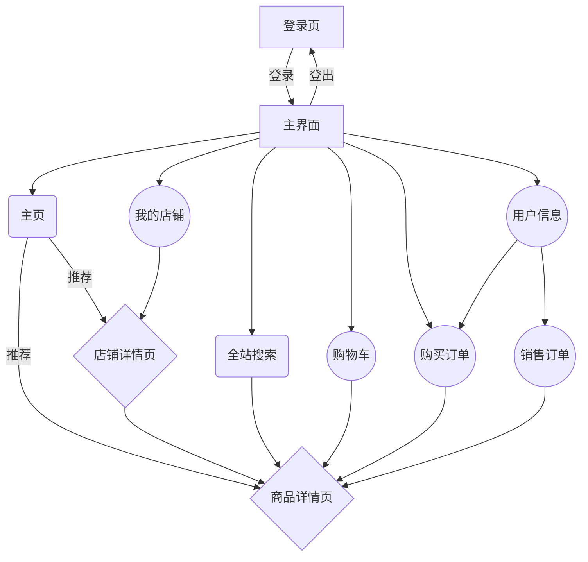
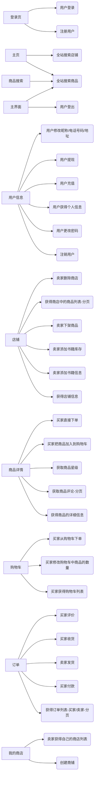
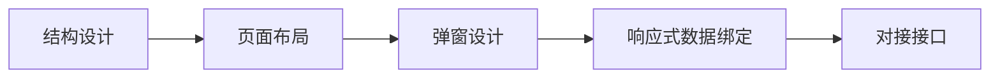

## 前端实验报告

### 前端技术介绍

#### Vue.js 3
*渐进式JavaScript 框架*
- Vue.js是一套构建用户界面的渐进式框架。
- Vue 只关注视图层，被设计为可以自底向上逐层应用。
- Vue 的目标是通过尽可能简单的 API 实现响应数据的绑定以及视图组件的组合使用。
- 另外，当与现代化的工具链以及各种支持类库结合使用时，Vue 也完全能够为复杂的单页应用提供驱动。

#### Quasar v2
*高性能&高质量的 Vue.js 3 用户界面框架*
- Quasar是一个高性能的 Vue.js 前端用户界面设计框架。
- Quasar CLI模式，对每种构建模式（SPA、SSR、PWA、移动应用程序、桌面应用程序和浏览器扩展）提供了一流的支持，并提供了最佳的开发人员体验，可以高效、灵活地进行高级开发者设计。
- Quasar v2 基于 Vue3，提供高性能的响应式前端组件，可以对页面的风格特性、布局网络、静态和动态组件进行高效的设计。
- Quasar 是最注重性能的框架之一。

#### Axios
*易用、简洁且高效的http库*
- Axios 是一个基于 promise 的 HTTP 库，可以用在浏览器和 node.js 中。
- Axios 从浏览器中创建 XMLHttpRequests，从 node.js 创建 http 请求，并且支持 Promise API
- Axios 可以高效地处理或拦截请求和响应，转换请求数据和响应数据

### 前端结构设计

### 前端接口设计

### 开发流程

### 页面展示

*待填入*

### 特点
- 数据响应式绑定，一方面简化开发人员对页面内容的操作方式，另一方面使用户实时直观地看到自己正在修改的内容对页面其他数据的影响。
- 采用高性能框架，减少前端页面内容对用户设备的页面渲染开销，并降低带宽压力。
- 网页模块化设计，有利于前端框架的维护工作，简化对前端进行进一步开发的流程。

### 后续开发方向
- 优化功能：调整页面布局和浏览器本地存储策略，优化用户的信息获取方式，减少用户重复填入信息的操作。
- 响应式支持：进一优化响应式布局设计，构建PC、平板电脑、手机端都能获得优秀使用体验的前端设计。